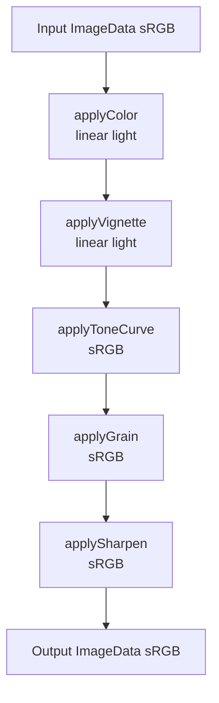
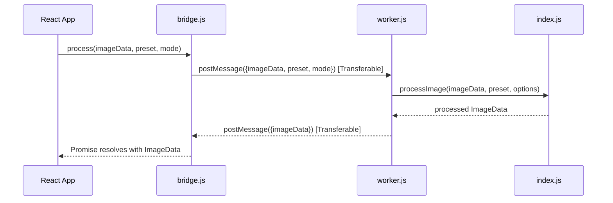

# Design Document: Grainframe Image Processing Pipeline

## Overview

The Grainframe pipeline is a framework-agnostic, pure-function image processing system that applies a sequence of photographic film emulation effects to a standard Web API `ImageData` object. It is designed to run inside a Web Worker so that image processing never blocks the main browser thread.

The pipeline is preset-driven: a JSON configuration object supplies all tuning parameters (channel multipliers, saturation, warmth, vignette intensity, tone curve control points, grain parameters, and sharpening amount). The same `processImage` entry point handles both live-preview and full-resolution export; only the resolution of the input `ImageData` differs between the two modes.

### Color Space Strategy

Two color spaces are used deliberately:

| Space | Where used | Why |
|---|---|---|
| Linear light | Color transform, Vignette | Physically accurate math (multiplication, blending) |
| sRGB (gamma) | Tone curve, Grain, Sharpen | Perceptually uniform; matches how humans see brightness |

Conversion between the two spaces is done exclusively via pre-computed 256-entry LUTs to avoid per-pixel `Math.pow` calls.

---

## Architecture

The pipeline is a thin, ordered chain of pure functions. There is no shared mutable state between stages; each stage receives an `ImageData` and mutates it in-place (except `processImage`, which works on a copy).



### Threading Model



The `ImageData` buffer is transferred (zero-copy) in both directions using the Web Transferable mechanism.

---

## Components and Interfaces

### `colorspace.js` — Color Space Conversion LUTs

Exports two pre-computed LUTs built at module load time. No functions are exported; all conversion is done via array lookup.

```js
export const srgbToLinearLUT: Float32Array  // [256] — index: 8-bit sRGB → value: linear [0,1]
export const linearToSrgbLUT: Uint8Array    // [256] — index: quantized linear (i/255) → value: 8-bit sRGB
```

Conversion formulas used to build the LUTs:
- sRGB → linear: `c <= 0.04045 ? c/12.92 : ((c+0.055)/1.055)^2.4`
- linear → sRGB: `v <= 0.0031308 ? v*12.92 : 1.055*v^(1/2.4) - 0.055`

### `canvas-utils.js` — Canvas / Context Helpers

```js
export function createCanvas(width, height): OffscreenCanvas | HTMLCanvasElement
export function getContext(canvas, options?): CanvasRenderingContext2D
```

`createCanvas` prefers `OffscreenCanvas` (available in Workers) and falls back to `document.createElement('canvas')`. `getContext` attempts a Display P3 wide-gamut context and falls back to standard sRGB.

### `color.js` — Color Grading (Linear Light)

```js
export function applyColor(imageData: ImageData, preset: Preset): void
```

Preset fields consumed: `rMult`, `gMult`, `bMult`, `saturation`, `warmth`.

Processing order per pixel:
1. sRGB → linear via `srgbToLinearLUT`
2. Apply per-channel multipliers
3. Convert linear RGB → HSL, scale S by `saturation`, convert back
4. Add `warmth` to R, subtract from B
5. linear → sRGB via `linearToSrgbLUT`

### `vignette.js` — Radial Vignette (Linear Light)

```js
export function applyVignette(imageData: ImageData, preset: Preset): void
```

Preset fields consumed: `vignetteIntensity`.

- Inner radius: `min(width, height) * 0.5`
- Outer radius: `max(width, height) * 0.75`
- Blend: `pixel *= 1 - effectiveIntensity * falloff`
- Corner darkening capped at 25% regardless of intensity

### `tonecurve.js` — Tone Curve (sRGB)

```js
export function buildToneCurveLUTs(preset: Preset): { r: Uint8Array, g: Uint8Array, b: Uint8Array }
export function applyToneCurve(imageData: ImageData, luts: ToneCurveLUTs): void
```

Preset fields consumed: `toneCurve.rgb`, `toneCurve.r`, `toneCurve.g`, `toneCurve.b`.

LUT construction uses Catmull-Rom spline interpolation over the provided control points. A monotonicity clamp (`lut[i] >= lut[i-1]`) is applied after interpolation. At apply time, the operation is a pure array lookup — no floating-point math.

### `grain.js` — Film Grain (sRGB)

```js
export function applyGrain(imageData: ImageData, preset: Preset, options?: GrainOptions): void
```

Preset fields consumed: `grainIntensity`, `grainSize`, `grainSeed`.
Options: `{ mode, previewWidth, exportWidth }`.

- Noise field generated with Mulberry32 seeded PRNG
- Noise blurred with `ctx.filter = 'blur(Xpx)'` to simulate grain clumping
- Grain scaled inversely with luminance: `lumScale = 1 - lum * 0.7`
- R and B channels receive 10% more grain than G
- Maximum intensity clamped to 0.04
- Grain size scaled by `exportWidth / previewWidth` in export mode

### `sharpen.js` — Unsharp Mask (sRGB)

```js
export function applySharpen(imageData: ImageData, preset: Preset): void
```

Preset fields consumed: `sharpenAmount`.

Formula: `output = clamp(original + (original - blurred) * amount, 0, 255)`
Maximum amount clamped to 0.3. Blur radius fixed at 1px.

### `blur.js` — Gaussian Blur Utility

```js
export function gaussianBlur(imageData: ImageData, radius: number): ImageData
```

Uses `ctx.filter = 'blur(Xpx)'` when available. Falls back to a 3-pass horizontal + vertical box blur when `ctx.filter` is unsupported (e.g., some Safari versions).

### `index.js` — Pipeline Orchestrator

```js
export function processImage(imageData: ImageData, preset: Preset, options?: ProcessOptions): ImageData
```

Options: `{ mode: 'preview' | 'export', previewWidth?: number, exportWidth?: number }`.

Works on a copy of the input `ImageData`; the original is never mutated. Executes all five stages in order.

### `worker.js` — Web Worker Entry Point

Listens for `message` events with `{ imageData, preset, mode, previewWidth, exportWidth }`. Calls `processImage` and returns the result via `postMessage` with the buffer as a Transferable. On error, returns `{ error: string }`.

### `bridge.js` — Main-Thread Promise Wrapper

```js
export function createPipelineWorker(): PipelineWorker

interface PipelineWorker {
  process(imageData: ImageData, preset: Preset, mode?: string, options?: object): Promise<ImageData>
  terminate(): void
}
```

Wraps the Worker in a Promise-based API. Supports one in-flight request at a time. `terminate()` rejects any pending promise and shuts down the Worker.

---

## Data Models

### Preset Object

```js
{
  // Stage 1 — Color (linear light)
  rMult: number,          // per-channel red multiplier (e.g. 0.97)
  gMult: number,          // per-channel green multiplier
  bMult: number,          // per-channel blue multiplier
  saturation: number,     // saturation scale factor (1.0 = unchanged)
  warmth: number,         // warmth offset added to R, subtracted from B

  // Stage 2 — Vignette (linear light)
  vignetteIntensity: number,  // [0, 1]

  // Stage 3 — Tone Curve (sRGB)
  toneCurve: {
    rgb: [[x, y], ...],   // master curve control points
    r:   [[x, y], ...],   // red channel override (optional)
    g:   [[x, y], ...],   // green channel override (optional)
    b:   [[x, y], ...],   // blue channel override (optional)
  },

  // Stage 4 — Grain (sRGB)
  grainIntensity: number, // [0, 0.04]
  grainSize: number,      // base blur radius in pixels
  grainSeed: number,      // integer seed for PRNG

  // Stage 5 — Sharpen (sRGB)
  sharpenAmount: number,  // [0, 0.3]
}
```

### ProcessOptions

```js
{
  mode: 'preview' | 'export',
  previewWidth: number,   // used to scale grain size in export mode
  exportWidth: number,
}
```

### ToneCurveLUTs

```js
{
  r: Uint8Array,  // 256 entries
  g: Uint8Array,
  b: Uint8Array,
}
```

---

## Correctness Properties

*A property is a characteristic or behavior that should hold true across all valid executions of a system — essentially, a formal statement about what the system should do. Properties serve as the bridge between human-readable specifications and machine-verifiable correctness guarantees.*

### Property 1: Color Space Round-Trip

*For any* 8-bit integer value v in [0, 255], converting it from sRGB to linear via `srgbToLinearLUT` and then back to sRGB via `linearToSrgbLUT[round(linear * 255)]` should produce a value within ±1 of v.

**Validates: Requirements 1.5**

---

### Property 2: Tone Curve LUT Validity

*For any* set of tone curve control points, the resulting 256-entry LUT must (a) have exactly 256 entries, (b) contain only values in [0, 255], and (c) be non-decreasing (monotonicity clamp applied).

**Validates: Requirements 3.1, 3.2**

---

### Property 3: Color Module No-Op Identity

*For any* ImageData, applying `applyColor` with a neutral preset (`rMult=1, gMult=1, bMult=1, saturation=1, warmth=0`) should produce output pixel values within ±1 of the input values (accounting for LUT quantization).

**Validates: Requirements 4.1, 4.5**

---

### Property 4: Saturation Zero Produces Grayscale

*For any* ImageData, applying `applyColor` with `saturation=0` should produce output pixels where R, G, and B channels are equal (grayscale).

**Validates: Requirements 4.3**

---

### Property 5: Warmth Shifts Red and Blue Channels

*For any* ImageData and any positive warmth value, applying `applyColor` with that warmth should produce output where the R channel is greater than or equal to the R channel produced with `warmth=0`, and the B channel is less than or equal to the B channel produced with `warmth=0`.

**Validates: Requirements 4.4**

---

### Property 6: Vignette Only Darkens

*For any* ImageData and any `vignetteIntensity` in [0, 1], every output pixel channel value should be less than or equal to the corresponding input pixel channel value (vignette is a darkening-only operation).

**Validates: Requirements 5.2**

---

### Property 7: Vignette Corner Cap

*For any* ImageData with `vignetteIntensity=1.0`, the corner pixels should be darkened by no more than 25% relative to their input values.

**Validates: Requirements 5.4**

---

### Property 8: Grain Determinism

*For any* ImageData and preset, calling `applyGrain` twice with the same seed on identical copies of the ImageData should produce identical output.

**Validates: Requirements 6.1**

---

### Property 9: Grain Luminance Dependence

*For any* two pixels where pixel A has lower luminance than pixel B, the absolute grain delta applied to pixel A should be greater than or equal to the grain delta applied to pixel B.

**Validates: Requirements 6.3**

---

### Property 10: Grain Channel Asymmetry

*For any* pixel, the grain magnitude applied to the R and B channels should be greater than or equal to the grain magnitude applied to the G channel.

**Validates: Requirements 6.4**

---

### Property 11: Grain Intensity Clamp

*For any* ImageData and any `grainIntensity` value (including values above 0.04), the absolute difference between any input and output channel value should not exceed `ceil(0.04 * 255)` = 11.

**Validates: Requirements 6.6**

---

### Property 12: Sharpen Amount Zero Is No-Op

*For any* ImageData, applying `applySharpen` with `sharpenAmount=0` should produce output identical to the input.

**Validates: Requirements 7.2**

---

### Property 13: Sharpen Output Clamped

*For any* ImageData and any `sharpenAmount`, all output pixel channel values should be in [0, 255].

**Validates: Requirements 7.3**

---

### Property 14: Sharpen Amount Cap

*For any* ImageData, applying `applySharpen` with `sharpenAmount=0.5` should produce the same output as applying it with `sharpenAmount=0.3` (the cap).

**Validates: Requirements 7.4**

---

### Property 15: processImage Does Not Mutate Input

*For any* ImageData, calling `processImage` should not modify the original ImageData's pixel data.

**Validates: Requirements 9.1, 9.6**

---

### Property 16: Classic Chrome Lifts Blacks and Compresses Highlights

*For any* call to `processImage` with the Classic Chrome preset, a pure black input pixel (0, 0, 0) should produce output with at least one channel value > 0 (lifted blacks), and a pure white input pixel (255, 255, 255) should produce output with at least one channel value < 255 (compressed highlights).

**Validates: Requirements 12.5**

---

## Error Handling

### Worker Errors

The `worker.js` entry point wraps `processImage` in a try/catch. Any thrown error is serialized to a string and returned as `{ error: string }` via `postMessage`. The Worker never crashes silently.

### Bridge Errors

`bridge.js` converts Worker error messages into rejected Promises with proper `Error` objects. If the Worker itself fires an `onerror` event (e.g., syntax error in the module), the pending Promise is also rejected.

### Pipeline Stage Errors

Individual pipeline stages do not throw on invalid preset values — they clamp inputs to valid ranges instead (e.g., `Math.min(MAX_AMOUNT, Math.max(0, preset.sharpenAmount ?? 0))`). This makes the pipeline robust to missing or out-of-range preset fields.

### Canvas Fallbacks

`canvas-utils.js` handles two graceful degradation paths:
- No `OffscreenCanvas` → falls back to `document.createElement('canvas')`
- No Display P3 context → falls back to standard sRGB `2d` context

### LUT Boundary Safety

`linearToSrgbLUT` is indexed with `Math.round(Math.min(1, value) * 255)`, ensuring the index is always in [0, 255] even if floating-point arithmetic produces values slightly outside [0, 1].

---

## Testing Strategy

### Dual Testing Approach

Both unit tests and property-based tests are required. They are complementary:

- **Unit tests** verify specific examples, known edge cases, and integration points
- **Property tests** verify universal invariants across randomly generated inputs

### Property-Based Testing Library

Use **fast-check** (npm: `fast-check`) — the standard property-based testing library for JavaScript/TypeScript. It integrates with Vitest and supports arbitrary generators for typed data.

```
npm install --save-dev fast-check
```

### Property Test Configuration

Each property test must run a minimum of **100 iterations**. Tag each test with a comment referencing the design property:

```js
// Feature: grainframe-pipeline, Property 1: Color Space Round-Trip
it('sRGB round-trip stays within ±1', () => {
  fc.assert(fc.property(fc.integer({ min: 0, max: 255 }), (v) => {
    const linear = srgbToLinearLUT[v];
    const back = linearToSrgbLUT[Math.round(linear * 255)];
    return Math.abs(back - v) <= 1;
  }), { numRuns: 256 });
});
```

Each correctness property in this document must be implemented by exactly one property-based test.

### Unit Test Focus Areas

- Specific known values (e.g., `srgbToLinearLUT[0] === 0`, `srgbToLinearLUT[255] ≈ 1`)
- Preset structure validation (Classic Chrome preset fields)
- Worker message protocol (send message, receive response)
- Bridge Promise resolution and rejection
- `createCanvas` / `getContext` fallback behavior
- `gaussianBlur` returns an ImageData with correct dimensions

### Test File Layout

```
grainframe/src/pipeline/
  __tests__/
    colorspace.test.js
    tonecurve.test.js
    color.test.js
    vignette.test.js
    grain.test.js
    sharpen.test.js
    blur.test.js
    index.test.js
    bridge.test.js
    presets.test.js
```

### Test Runner

Vitest (already configured in the project). Run with:

```
npx vitest --run
```
