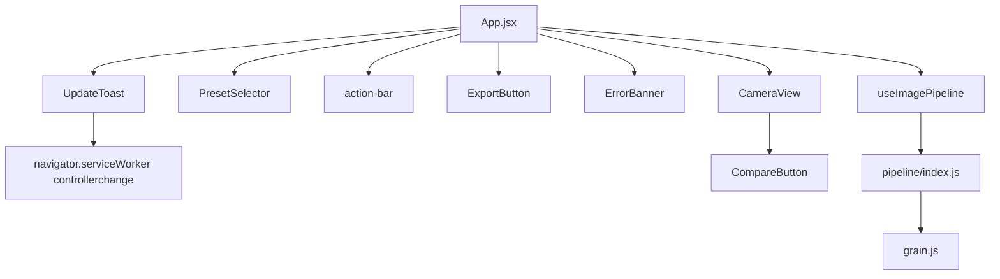

# Design Document: Grainframe Polish

## Overview

This document covers the Phase 3 polish, performance, and production-readiness work for the Grainframe PWA. The scope is deliberately narrow: fix known gaps in the existing implementation rather than redesign anything. The changes fall into nine areas — landscape layout, OOM recovery hardening, performance timing, grain resolution wiring, offline verification, cross-browser compatibility documentation, accessibility audit, PWA icon generation, and a PWA update toast.

The app is a React + Vite PWA that runs an image processing pipeline in a Web Worker. The pipeline applies color transforms, vignette, tone curve, film grain, and sharpening to photos. The UI is a single-screen layout with a full-screen camera view, a horizontal preset strip, and an action bar.

## Architecture

The existing architecture is unchanged. This phase adds one new component (`UpdateToast`), one new script (`scripts/generate-icons.js`), and modifies several existing files in-place.

```
src/
  App.jsx                    ← mount UpdateToast
  styles/
    App.css                  ← add landscape media query
    UpdateToast.css          ← new
  components/
    UpdateToast.jsx          ← new
  hooks/
    useImagePipeline.js      ← add performance.now() timing
  pipeline/
    index.js                 ← verify grain options wiring
  utils/
    errors.js                ← fix IMAGE_TOO_LARGE
    export.js                ← add try/catch around canvas.toBlob
    image.js                 ← add try/catch around OffscreenCanvas
vite.config.js               ← navigateFallback, icon manifest
index.html                   ← already has PWA meta tags (verify complete)
scripts/
  generate-icons.js          ← new Node script
public/icons/
  icon-192.png               ← generated
  icon-512.png               ← generated
  icon-180.png               ← generated
BROWSER-COMPAT.md            ← new compatibility tracking doc
PERFORMANCE.md               ← per-stage timing breakdown template
```



## Components and Interfaces

### Landscape Layout (App.css)

A single `@media (orientation: landscape)` block on `.app` switches from `flex-direction: column` to a CSS Grid two-column layout. No JavaScript is involved.

The preset selector moves to the right column as a **vertical strip of small horizontal pills** — each pill keeps its normal horizontal text layout but the strip itself is stacked vertically (using `flex-direction: column` and `overflow-y: auto`). `writing-mode` is not used. The pills shrink to fit the 80px column width.

```css
@media (orientation: landscape) {
  .app {
    display: grid;
    grid-template-columns: 1fr 80px;
    grid-template-rows: 1fr auto;
  }
  /* CameraView fills entire left column */
  .camera-view {
    grid-column: 1;
    grid-row: 1 / span 2;
  }
  /* Preset selector: vertical stack of small pills in right column */
  .preset-selector {
    grid-column: 2;
    grid-row: 1;
    height: auto;
    flex-direction: column;
    overflow-y: auto;
    padding: 8px 4px;
  }
  /* Action bar: stacked vertically in right column below preset selector */
  .action-bar {
    grid-column: 2;
    grid-row: 2;
    flex-direction: column;
    height: auto;
    padding-bottom: var(--safe-bottom);
    gap: 16px;
  }
}
```

The right column is fixed at 80px. The CameraView fills the remaining width. No "rotate your device" message is added — the layout simply adapts.

### UpdateToast Component

A new component that detects when a new service worker takes control and shows a 3-second auto-dismissing toast.

`onNeedRefresh` from `vite-plugin-pwa` does **not** fire with `registerType: 'autoUpdate'` — the SW updates silently. Instead, listen for the native `navigator.serviceWorker` `controllerchange` event, which fires when a new SW activates and takes control of the page.

```jsx
// src/components/UpdateToast.jsx
import { useEffect, useState } from 'react';
import '../styles/UpdateToast.css';

export default function UpdateToast() {
  const [visible, setVisible] = useState(false);

  useEffect(() => {
    if (!('serviceWorker' in navigator)) return;

    function handleControllerChange() {
      setVisible(true);
    }

    navigator.serviceWorker.addEventListener('controllerchange', handleControllerChange);
    return () => {
      navigator.serviceWorker.removeEventListener('controllerchange', handleControllerChange);
    };
  }, []);

  useEffect(() => {
    if (!visible) return;
    const t = setTimeout(() => setVisible(false), 3000);
    return () => clearTimeout(t);
  }, [visible]);

  if (!visible) return null;
  return <div className="update-toast" role="status" aria-live="polite">App updated</div>;
}
```

Do **not** import from `virtual:pwa-register/react`. CSS positions the toast `bottom: calc(80px + env(safe-area-inset-bottom) + 12px)` so it sits above the action bar without obscuring controls. Background `#1a1a1a`, text `#f0ede8`.

### OOM Error Hardening

Two files get try/catch wrappers around canvas operations:

**`utils/image.js` — `resizeToMax`**: Wrap the `new OffscreenCanvas(...)` and `getImageData` calls. On `RangeError` or memory-related error, rethrow as `ErrorTypes.IMAGE_TOO_LARGE`.

**`utils/export.js`**: The `canvas.toBlob` call (if present) or any canvas creation during export gets a try/catch. On OOM, rethrow as `ErrorTypes.EXPORT_FAILED`.

**`utils/errors.js`** — fix `IMAGE_TOO_LARGE`:
```js
IMAGE_TOO_LARGE: {
  message: 'This image is too large to process. Try a smaller photo.',
  recoverable: true,
},
```

The existing OOM retry in `useImagePipeline` (downscale to 50% and retry) is not touched. The `ErrorBanner` already handles `recoverable: true` errors with a "Try Again" action that calls `onRetry`, which triggers `triggerImport()`.

### Performance Timing

In `useImagePipeline.js`, wrap the worker round-trip with `performance.now()`:

```js
const t0 = performance.now();
result = await worker.process(clone, preset, mode);
if (import.meta.env.DEV) {
  console.log(`Pipeline ${mode}: ${Math.round(performance.now() - t0)}ms`);
}
```

This applies to both `processPreview` and `processExport`. If preview timing exceeds 800ms during profiling, `PREVIEW_MAX_DIM` in `pipeline/index.js` is reduced from 1024 to 768.

### Grain Options Wiring

`pipeline/index.js` already passes `options` through to `applyGrain`. The current call is:

```js
applyGrain(out, preset, options);
```

The `options` object must include `{ mode, previewWidth, exportWidth }`. In `useImagePipeline.js`, the worker call passes `mode` as a string but not `previewWidth`/`exportWidth`. The fix is to pass a full options object:

```js
// In processPreview:
worker.process(clone, preset, { mode: 'preview', previewWidth: PREVIEW_MAX_DIM })

// In processExport:
worker.process(clone, preset, { mode: 'export', previewWidth: PREVIEW_MAX_DIM, exportWidth: imageData.width })
```

`grain.js` already reads `options.previewWidth ?? width` and `options.exportWidth ?? width`, so the fallback is safe. The `resolutionRatio` calculation is already correct in `grain.js`.

### PWA Icon Generation Script

`scripts/generate-icons.js` is a Node.js script using the `canvas` npm package (or the built-in `node:canvas` if available). It draws a `#0e0e0e` background and a "G" lettermark in `#c9a96e` at three sizes (192, 512, 180) and writes PNG files to `public/icons/`.

```js
// scripts/generate-icons.js
import { createCanvas } from 'canvas';
import { writeFileSync } from 'fs';

const sizes = [192, 512, 180];
for (const size of sizes) {
  const canvas = createCanvas(size, size);
  const ctx = canvas.getContext('2d');
  ctx.fillStyle = '#0e0e0e';
  ctx.fillRect(0, 0, size, size);
  ctx.fillStyle = '#c9a96e';
  ctx.font = `bold ${Math.round(size * 0.55)}px serif`;
  ctx.textAlign = 'center';
  ctx.textBaseline = 'middle';
  ctx.fillText('G', size / 2, size / 2);
  writeFileSync(`public/icons/icon-${size}.png`, canvas.toBuffer('image/png'));
}
```

Run once: `node scripts/generate-icons.js`. The generated files are committed to the repo.

### vite.config.js Updates

Two additions (the blob runtimeCaching entry is removed — blob URLs never pass through the service worker so a NetworkOnly rule for them does nothing):

1. `navigateFallback: 'index.html'` in the `workbox` config so offline navigation works.
2. `icons` array in the manifest with all three sizes.

```js
workbox: {
  globPatterns: ['**/*.{js,css,html,png,json}'],
  navigateFallback: 'index.html',
},
manifest: {
  name: 'Grainframe',
  short_name: 'Grainframe',
  display: 'standalone',
  background_color: '#0e0e0e',
  theme_color: '#0e0e0e',
  icons: [
    { src: '/icons/icon-192.png', sizes: '192x192', type: 'image/png' },
    { src: '/icons/icon-512.png', sizes: '512x512', type: 'image/png' },
    { src: '/icons/icon-180.png', sizes: '180x180', type: 'image/png' },
  ],
},
```

### Accessibility Audit

- Each interactive button in `App.jsx` already has `aria-label`. Verify `ExportButton`, `PresetSelector` preset buttons, and `CompareButton` all have labels.
- `CompareButton` already has `role="button"` and `aria-label="Show original photo"` — no change needed.
- `ErrorBanner` needs `aria-live="polite"` and `role="alert"` verified/added.
- Add `focus-visible` CSS to `index.css`:
  ```css
  :focus-visible {
    outline: 2px solid #c9a96e;
    outline-offset: 2px;
  }
  ```
- Verify all tap targets are ≥44×44px by inspecting computed styles.

### Cross-Browser Fallback

The existing synchronous main-thread fallback in `useWorker.js` handles environments where `OffscreenCanvas` is unavailable (Safari iOS 15). When `createPipelineWorker` fails or `OffscreenCanvas` is absent, `useWorker` returns `{ worker: null }` and `useImagePipeline` falls back to calling `processImage` directly on the main thread. No `setTimeout` yields are added. This path is already correct — document it, no code change.

### BROWSER-COMPAT.md

A template file with pass/fail columns for each target browser, to be filled in manually after testing.

## Data Models

No new data models. The existing `ErrorTypes` object in `errors.js` is updated in-place:

```js
IMAGE_TOO_LARGE: {
  message: 'This image is too large to process. Try a smaller photo.',
  recoverable: true,
}
```

The `UpdateToast` component has no persistent state — it uses a single `visible: boolean` local state driven by the `navigator.serviceWorker` `controllerchange` event.

Grain options passed through the pipeline:

```js
// Preview
{ mode: 'preview', previewWidth: 1024 }

// Export
{ mode: 'export', previewWidth: 1024, exportWidth: imageData.width }
```

## Correctness Properties

*A property is a characteristic or behavior that should hold true across all valid executions of a system — essentially, a formal statement about what the system should do. Properties serve as the bridge between human-readable specifications and machine-verifiable correctness guarantees.*

### Property 1: OOM errors are caught and surfaced

*For any* canvas operation in `utils/export.js` or `utils/image.js` that throws a `RangeError` or an error whose message contains "memory" or "allocation", the error SHALL be caught and the function SHALL reject with a known `ErrorTypes` value rather than propagating an unhandled rejection.

**Validates: Requirements 2.1**

### Property 2: DEV mode pipeline timing is always logged

*For any* call to `processPreview` or `processExport` when `import.meta.env.DEV` is `true`, the hook SHALL call `console.log` with a string matching `"Pipeline preview:"` or `"Pipeline export:"` followed by a millisecond count.

**Validates: Requirements 3.6**

### Property 3: Grain blur radius scales with export/preview ratio

*For any* preset with `grainIntensity > 0` and any pair of `(previewWidth, exportWidth)` where `exportWidth > previewWidth`, calling `applyGrain` in export mode SHALL produce a `blurRadius` equal to `Math.max(0.5, baseSize * (exportWidth / previewWidth))`, which is strictly greater than the preview-mode `blurRadius` of `Math.max(0.5, baseSize)`. The preset field is `grainSize` (flat, not nested).

**Validates: Requirements 4.1, 4.2**

### Property 4: Preview mode grain uses unscaled base size

*For any* preset with `grainIntensity > 0`, calling `applyGrain` in preview mode SHALL use `blurRadius = Math.max(0.5, preset.grainSize * 1)` — i.e., the resolution ratio is 1 and no scaling is applied. The preset field is `grainSize` (flat, not nested).

**Validates: Requirements 4.3**

### Property 5: Export grain is visible for any non-zero intensity

*For any* `ImageData` and any preset with `grainIntensity > 0`, calling `applyGrain` in export mode SHALL produce an output `ImageData` where at least one pixel differs from the input. The preset field is `grainIntensity` (flat, not nested).

**Validates: Requirements 4.4**

### Property 6: All interactive buttons have aria-labels

*For any* button rendered by the app (capture, import, export, compare, preset selection), the rendered DOM element SHALL have a non-empty `aria-label` attribute.

**Validates: Requirements 7.1**

### Property 7: UpdateToast auto-dismisses after 3 seconds

*For any* `controllerchange` event fired on `navigator.serviceWorker`, the `UpdateToast` component SHALL become visible immediately and SHALL become invisible after exactly 3000ms (using `setTimeout`), without requiring any user interaction.

**Validates: Requirements 9.2**

## Error Handling

| Scenario | Error Type | Recoverable | User Action |
|---|---|---|---|
| Canvas OOM in `image.js` | `IMAGE_TOO_LARGE` | true | "Try Again" → re-opens file picker |
| Canvas OOM in `export.js` | `EXPORT_FAILED` | true | "Try Again" → retry export |
| Both OOM retries fail in pipeline | `IMAGE_TOO_LARGE` | true | "Try Again" → re-opens file picker |
| Image load failure | `IMAGE_LOAD_FAILED` | true | "Try Again" → re-opens file picker |
| General processing failure | `PROCESSING_FAILED` | true | "Try Again" → retry |

The `ErrorBanner` component already handles `recoverable: true` by showing a "Try Again" button that calls `onRetry`. The `IMAGE_TOO_LARGE` fix (changing `recoverable: false` → `true`) ensures users are not stuck after a large-image failure.

Error propagation flow for canvas OOM:
```
resizeToMax() throws RangeError
  → caught in image.js, rethrown as ErrorTypes.IMAGE_TOO_LARGE
  → caught in useCamera or useImagePipeline
  → setError(ErrorTypes.IMAGE_TOO_LARGE)
  → ErrorBanner renders with "Try Again"
  → onRetry() → triggerImport()
```

## Testing Strategy

### Unit Tests

Unit tests cover specific examples and error conditions:

- `errors.js`: Verify `IMAGE_TOO_LARGE` has `recoverable: true` and the correct message string.
- `image.js`: Verify `resizeToMax` catches a simulated `RangeError` and rejects with `IMAGE_TOO_LARGE`.
- `export.js`: Verify canvas OOM is caught and rejects with `EXPORT_FAILED`.
- `UpdateToast`: Render, simulate a `controllerchange` event on `navigator.serviceWorker`, verify "App updated" text is present; verify it is absent after 3000ms (fake timers). Do not use `virtual:pwa-register/react`.
- `CompareButton`: Render and verify `role="button"` and `aria-label="Show original photo"`.
- `ErrorBanner`: Render and verify `aria-live="polite"` and `role="alert"`.
- `vite.config.js`: Verify manifest contains all three icon entries and `navigateFallback` is set.
- `index.html`: Verify `<link rel="apple-touch-icon" href="/icons/icon-180.png">` is present.

### Property-Based Tests

Property-based tests use [fast-check](https://github.com/dubzzz/fast-check) (already available in the JS ecosystem, compatible with Vitest). Each test runs a minimum of 100 iterations.

**Property 1: OOM errors are caught and surfaced**
```
// Feature: grainframe-polish, Property 1: OOM errors are caught and surfaced
fc.assert(fc.asyncProperty(
  fc.oneof(fc.constant(new RangeError('OOM')), fc.constant(new Error('memory allocation failed'))),
  async (err) => {
    // Simulate OffscreenCanvas constructor throwing err
    // Call resizeToMax with mocked OffscreenCanvas
    // Verify the rejection is an ErrorTypes value, not the raw error
  }
), { numRuns: 100 });
```

**Property 2: DEV mode pipeline timing is always logged**
```
// Feature: grainframe-polish, Property 2: DEV mode pipeline timing is always logged
fc.assert(fc.asyncProperty(
  arbitraryImageData(), arbitraryPreset(),
  async (imageData, preset) => {
    // Set import.meta.env.DEV = true
    // Call processPreview(imageData, preset)
    // Verify console.log was called with /Pipeline preview: \d+ms/
  }
), { numRuns: 100 });
```

**Property 3: Grain blur radius scales with export/preview ratio**
```
// Feature: grainframe-polish, Property 3: Grain blur radius scales with export/preview ratio
fc.assert(fc.property(
  fc.integer({ min: 100, max: 1024 }),   // previewWidth
  fc.integer({ min: 1025, max: 4096 }), // exportWidth
  fc.float({ min: 0.5, max: 3.0 }),     // grainSize (flat field)
  (previewWidth, exportWidth, grainSize) => {
    const expectedRatio = exportWidth / previewWidth;
    const expectedBlur = Math.max(0.5, grainSize * expectedRatio);
    // Verify applyGrain uses this blurRadius in export mode
    // preset uses flat fields: { grainIntensity, grainSize, grainSeed }
    return expectedBlur > Math.max(0.5, grainSize);
  }
), { numRuns: 100 });
```

**Property 4: Preview mode grain uses unscaled base size**
```
// Feature: grainframe-polish, Property 4: Preview mode grain uses unscaled base size
fc.assert(fc.property(
  fc.record({
    grainIntensity: fc.float({ min: 0.001, max: 0.04 }),
    grainSize: fc.float({ min: 0.5, max: 3.0 }),
    grainSeed: fc.integer({ min: 0, max: 9999 }),
  }),
  (preset) => {
    // Call applyGrain with mode: 'preview'
    // Verify blurRadius = Math.max(0.5, preset.grainSize)
    // preset uses flat fields — NOT preset.grain.size
  }
), { numRuns: 100 });
```

**Property 5: Export grain is visible for any non-zero intensity**
```
// Feature: grainframe-polish, Property 5: Export grain is visible for any non-zero intensity
fc.assert(fc.property(
  arbitraryImageData(),
  fc.float({ min: 0.001, max: 0.04 }),
  (imageData, intensity) => {
    // preset uses flat fields — NOT { grain: { intensity } }
    const preset = { grainIntensity: intensity, grainSize: 1, grainSeed: 42 };
    const before = new Uint8ClampedArray(imageData.data);
    applyGrain(imageData, preset, { mode: 'export', previewWidth: 1024, exportWidth: imageData.width });
    return somePixelDiffers(before, imageData.data);
  }
), { numRuns: 100 });
```

**Property 6: All interactive buttons have aria-labels**
```
// Feature: grainframe-polish, Property 6: All interactive buttons have aria-labels
// Render App with arbitrary image state, query all button elements,
// verify each has a non-empty aria-label attribute.
fc.assert(fc.property(
  arbitraryAppState(),
  (state) => {
    const { getAllByRole } = render(<App />, { state });
    const buttons = getAllByRole('button');
    return buttons.every(btn => btn.getAttribute('aria-label')?.trim().length > 0);
  }
), { numRuns: 100 });
```

**Property 7: UpdateToast auto-dismisses after 3 seconds**
```
// Feature: grainframe-polish, Property 7: UpdateToast auto-dismisses after 3 seconds
fc.assert(fc.property(
  fc.integer({ min: 1, max: 10 }), // number of controllerchange events
  (n) => {
    vi.useFakeTimers();
    // Simulate navigator.serviceWorker controllerchange event n times
    // After each event, advance timers by 3000ms
    // Verify toast is not visible after each 3000ms advance
    // Do NOT use onNeedRefresh or virtual:pwa-register/react
  }
), { numRuns: 100 });
```

### Dual Coverage Summary

Unit tests catch concrete bugs in specific scenarios (wrong error message, missing aria attribute, wrong icon path). Property tests verify universal correctness across all inputs (grain scaling math, OOM catch coverage, timing log invariant, toast dismiss timing). Both are required for comprehensive coverage.
