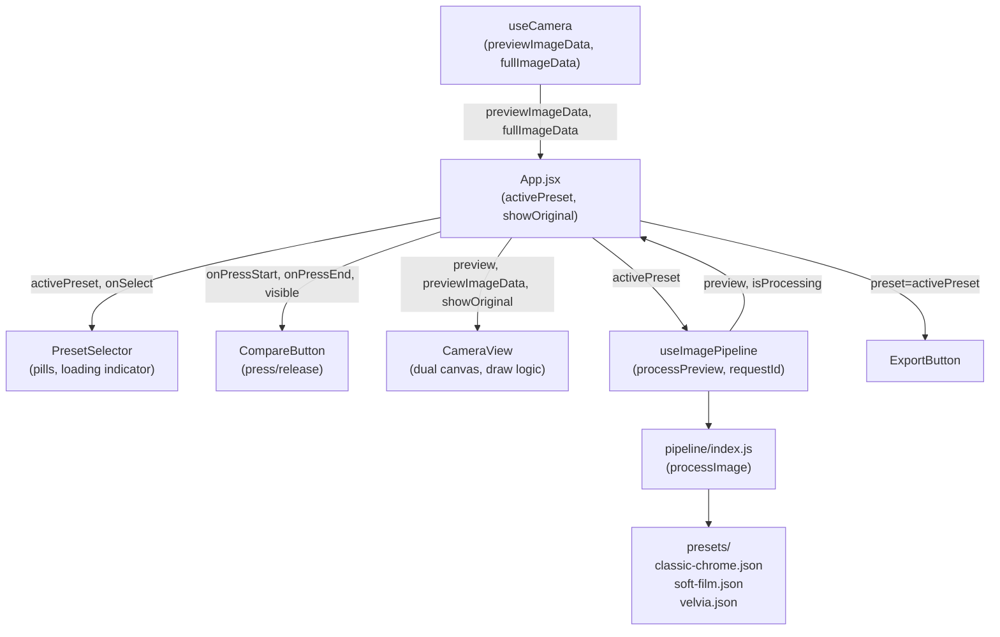

# Design Document: Preset Switcher & Compare

## Overview

This feature extends Grainframe with two new film-look presets (Soft Film, Velvia), a horizontal scrollable PresetSelector UI for switching between all three presets, and a CompareButton for instant press-and-hold before/after comparison. App.jsx is updated to own `activePreset` and `showOriginal` state, wiring the new components into the existing pipeline and canvas infrastructure.

The design deliberately avoids new abstractions where existing ones suffice. The `useImagePipeline` hook's existing request-ID cancellation mechanism handles rapid preset switching. The existing single canvas in CameraView is extended with a dual-canvas cross-fade for preset transitions, while the compare swap remains a direct `putImageData` call with no animation.

---

## Architecture



Data flow on preset change:
1. User taps pill → `onSelect(presetId)` → App sets `activePreset`
2. App calls `processPreview(previewImageData, newPreset)` — `requestIdRef` in `useImagePipeline` auto-cancels any in-flight request
3. `isProcessing` becomes true → PresetSelector shows loading indicator
4. Pipeline completes → `preview` updated → CameraView cross-fades to new result
5. `isProcessing` becomes false → loading indicator hidden

Data flow on compare press:
1. `pointerdown` on CompareButton → `onPressStart()` → App sets `showOriginal = true`
2. CameraView's unified draw effect fires → `putImageData(previewImageData)` — instant, no transition
3. `pointerup`/`pointerleave` → `onPressEnd()` → App sets `showOriginal = false`
4. CameraView draw effect fires → `putImageData(preview)` — instant, no transition

---

## Components and Interfaces

### PresetSelector

**File:** `src/components/PresetSelector.jsx` + `src/styles/PresetSelector.css`

```jsx
// Props
{
  presets: Array<{ id: string, name: string }>,  // ordered list
  activePresetId: string,
  onSelect: (id: string) => void,
  isProcessing: boolean,
  visible: boolean,
}
```

Renders a `<div role="toolbar">` containing a horizontally scrollable `<div>` of pill `<button>` elements. When `visible` is false, returns null. The active pill receives a CSS class `pill--active` which applies the gold border. When `isProcessing` is true, the active pill's gold border pulses using a CSS opacity keyframe animation instead of a separate loading indicator element:

```css
@keyframes pulse {
  0%, 100% { opacity: 1; }
  50%       { opacity: 0.4; }
}
.pill--active.processing {
  animation: pulse 1s ease-in-out infinite;
}
```

The existing progress bar in CameraView handles the main loading state; no separate loading element is added to PresetSelector.

CSS key rules:
- `overflow-x: scroll; touch-action: pan-x; -webkit-overflow-scrolling: touch` on the scroll container
- `.pill--active { border: 2px solid #c9a96e; }`
- Pill min-height: 44px for tap target compliance

### CompareButton

**File:** `src/components/CompareButton.jsx` + `src/styles/CompareButton.css`

```jsx
// Props
{
  onPressStart: () => void,
  onPressEnd: () => void,
  visible: boolean,
}
```

Renders a single `<button>` with `aria-label="Show original photo"` and text label "ORIGINAL". When `visible` is false, returns null. Handles `pointerdown`/`pointerup`/`pointerleave` as primary events, with `touchstart`/`touchend` as fallback (calling `preventDefault()` on `touchstart`). Applies a CSS class `compare-btn--pressed` while held to show the gold accent pressed state.

Positioned `position: absolute; top: 12px; left: 12px` within the preview area (inside CameraView's container or as a sibling absolutely positioned over it).

### CameraView

**File:** `src/components/CameraView.jsx` (modified)

New props added:
```jsx
showOriginal: boolean,  // when true, draw previewImageData; when false, draw preview
```

The two existing `useEffect` hooks (one for `previewImageData`, one for `preview`) are replaced with two separate, non-interfering effects:

**Effect 1 — showOriginal toggle** (depends on `[showOriginal, previewImageData, preview]`):
```js
useEffect(() => {
  const canvas = canvasFrontRef.current;
  if (!canvas) return;
  const ctx = canvas.getContext('2d');
  const data = showOriginal ? previewImageData : preview;
  if (data) ctx.putImageData(data, 0, 0);  // instant, no CSS transition
}, [showOriginal, previewImageData, preview]);
```

**Effect 2 — new preview arriving** (depends on `[preview]`):
```js
useEffect(() => {
  if (!preview || showOriginal) return;  // skip if compare is held
  // Run dual-canvas cross-fade sequence
  const back = canvasBackRef.current;
  const front = canvasFrontRef.current;
  if (!back || !front) return;
  back.width = preview.width; back.height = preview.height;
  back.getContext('2d').putImageData(preview, 0, 0);
  front.classList.add('fading');
  const onEnd = () => {
    front.getContext('2d').putImageData(preview, 0, 0);
    front.classList.remove('fading');  // restore opacity 1, no transition
    back.getContext('2d').clearRect(0, 0, back.width, back.height);
    front.removeEventListener('transitionend', onEnd);
  };
  front.addEventListener('transitionend', onEnd, { once: true });
}, [preview]);
```

Effect 1 is always instant. Effect 2 always uses the cross-fade. They do not interfere because Effect 2 skips when `showOriginal` is true.

### App.jsx

New state:
```js
const [activePreset, setActivePreset] = useState(classicChrome);
const [showOriginal, setShowOriginal] = useState(false);
```

`previewImageData` from `useCamera` is the original — it is never overwritten on preset change.

On preset change:
```js
function handleSelectPreset(id) {
  const preset = PRESETS.find(p => p.id === id);
  setActivePreset(preset);
  processPreview(previewImageData, preset);
}
```

On new photo load (via `useEffect` on `previewImageData`):
```js
useEffect(() => {
  if (previewImageData) {
    setActivePreset(classicChrome);
    processPreview(previewImageData, classicChrome);
  }
}, [previewImageData]);
```

`PRESETS` constant (ordered):
```js
import classicChrome from './presets/classic-chrome.json';
import softFilm from './presets/soft-film.json';
import velvia from './presets/velvia.json';

const PRESETS = [classicChrome, softFilm, velvia];
```

Props passed to children:
- `CameraView`: `preview`, `previewImageData`, `showOriginal`
- `PresetSelector`: `presets={PRESETS}`, `activePresetId={activePreset.id}`, `onSelect={handleSelectPreset}`, `isProcessing`, `visible={!!preview}`
- `CompareButton`: `onPressStart={() => setShowOriginal(true)}`, `onPressEnd={() => setShowOriginal(false)}`, `visible={!!preview}`
- `ExportButton`: `preset={activePreset}`

---

## Data Models

### Preset Schema

All preset JSON files conform to the flat schema established by `classic-chrome.json`:

```ts
interface Preset {
  id: string;           // kebab-case identifier
  name: string;         // display name

  // Color channel multipliers (applied in linear light)
  rMult: number;
  gMult: number;
  bMult: number;

  saturation: number;   // 1.0 = no change; < 1 desaturates; > 1 saturates
  warmth: number;       // positive = warmer (shifts R up, B down); negative = cooler

  vignetteIntensity: number;  // 0–1; 0 = no vignette

  toneCurve: {
    rgb: [number, number][];  // master curve control points [input, output]
    r:   [number, number][];
    g:   [number, number][];
    b:   [number, number][];
  };

  grainIntensity: number;  // amplitude of grain noise
  grainSize: number;       // spatial scale of grain
  grainSeed: number;       // RNG seed for reproducibility

  sharpenAmount: number;   // 0 = no sharpening; 1 = full
}
```

### soft-film.json (target values)

| Field | Value | Rationale |
|---|---|---|
| `warmth` | `0.012` | Positive → warm shift |
| `saturation` | `0.82` | Within 0.75–0.90 range |
| `rMult` | `1.02` | Slight red boost for warmth |
| `gMult` | `0.98` | Neutral |
| `bMult` | `0.94` | Reduced blue for warmth |
| `vignetteIntensity` | `0.12` | ≤ 0.15 subtle vignette |
| `grainIntensity` | `0.015` | ≤ 0.02 low grain |
| `grainSize` | `1.4` | Slightly larger, softer grain |
| `grainSeed` | `12` | |
| `sharpenAmount` | `0.05` | Softer look |
| `toneCurve` | see below | Warm tones with lifted blacks (shadow output ≥ 25) |

Complete `toneCurve` for soft-film:
```json
"toneCurve": {
  "rgb": [[0,30],[64,76],[128,132],[192,188],[255,240]],
  "r":   [[0,32],[64,78],[128,134],[192,190],[255,242]],
  "g":   [[0,28],[64,74],[128,130],[192,186],[255,238]],
  "b":   [[0,26],[64,72],[128,128],[192,184],[255,234]]
}
```

### velvia.json (target values)

| Field | Value | Rationale |
|---|---|---|
| `warmth` | `-0.002` | Slightly cool/neutral |
| `saturation` | `1.20` | ≥ 1.15 vivid |
| `rMult` | `1.01` | Slight red boost |
| `gMult` | `0.98` | Neutral |
| `bMult` | `1.08` | ≥ 1.06 deep blues |
| `vignetteIntensity` | `0.22` | ≥ 0.20, capped at 25% corner darkness by pipeline |
| `grainIntensity` | `0.030` | Within 0.025–0.035 |
| `grainSize` | `1.1` | Fine grain |
| `grainSeed` | `42` | |
| `sharpenAmount` | `0.15` | Crisp look |
| `toneCurve` | see below | Deep shadows (shadow output ≤ 10) and strong contrast |

Complete `toneCurve` for velvia:
```json
"toneCurve": {
  "rgb": [[0,5],[64,68],[128,135],[192,198],[255,225]],
  "r":   [[0,6],[64,70],[128,137],[192,200],[255,228]],
  "g":   [[0,4],[64,66],[128,133],[192,196],[255,222]],
  "b":   [[0,8],[64,72],[128,138],[192,202],[255,230]]
}
```

---

## Cross-Fade Implementation

The 150ms cross-fade on preset change uses two stacked `<canvas>` elements inside CameraView:

```
canvasBack   (z-index: 1, bottom)  — receives new frame while canvasFront is still visible
canvasFront  (z-index: 2, top)     — currently visible; transitions opacity 1→0 over 150ms
```

CSS:
```css
.canvas-front {
  transition: opacity 150ms ease;
}
.canvas-front.fading {
  opacity: 0;
}
```

Sequence on new `preview` arriving:
1. Draw new `preview` to `canvasBack`
2. Add class `fading` to `canvasFront` — triggers CSS opacity transition 1→0 over 150ms
3. On `transitionend`: draw new content to `canvasFront`, remove `fading` class (restores opacity to 1 with no transition), clear `canvasBack`

For the compare swap (`showOriginal` toggle): bypass the cross-fade entirely. Call `putImageData` directly on `canvasFront` with no CSS transition class applied. This ensures the instant swap required by Requirements 6.3/6.4.

---

## CSS Layout

The app uses a flex column layout to prevent overlap on small screens and handle iPhone notch/home-bar areas:

```css
.app {
  display: flex;
  flex-direction: column;
  height: 100dvh;
}

.camera-view {          /* preview area */
  flex: 1;
  position: relative;
  overflow: hidden;
}

.preset-selector {      /* pill bar */
  height: 48px;
  flex-shrink: 0;
}

.action-bar {           /* capture/import buttons */
  height: calc(80px + env(safe-area-inset-bottom));
  flex-shrink: 0;
}
```

The `.action-bar` is moved out of `.camera-view`'s absolute positioning and into the flex column so it stacks below the preset bar without overlapping the preview canvas.

---

## Preset Validation

A `validatePreset(preset)` utility is added to `src/utils/image.js` (or a new `src/utils/presets.js`). It is called in `App.jsx` before passing a preset to `processPreview` or `processExport`:

```js
const REQUIRED_PRESET_FIELDS = [
  'id', 'name', 'rMult', 'gMult', 'bMult', 'saturation', 'warmth',
  'vignetteIntensity', 'grainIntensity', 'grainSize', 'grainSeed',
  'sharpenAmount'
];

function validatePreset(preset) {
  for (const field of REQUIRED_PRESET_FIELDS) {
    if (preset[field] === undefined) throw new Error(`Preset missing field: ${field}`);
  }
  if (!preset.toneCurve?.r || !preset.toneCurve?.g || !preset.toneCurve?.b) {
    throw new Error('Preset missing toneCurve channels');
  }
}
```

If validation fails, the thrown `Error` propagates to `useImagePipeline`'s existing `catch` block, which sets `pipelineError` and surfaces it via `ErrorBanner`.

---

## Correctness Properties

*A property is a characteristic or behavior that should hold true across all valid executions of a system — essentially, a formal statement about what the system should do. Properties serve as the bridge between human-readable specifications and machine-verifiable correctness guarantees.*

### Property 1: Three preset outputs are pixel-distinct

*For any* valid source ImageData, running the pipeline with classic-chrome, soft-film, and velvia presets should produce three ImageData buffers where no two are byte-for-byte identical.

**Validates: Requirements 3.1**

### Property 2: Soft-film lifts shadows above classic-chrome

*For any* valid source ImageData, the average luminance of pixels in the darkest quartile of the soft-film output should be strictly greater than the average luminance of the same pixels in the classic-chrome output.

**Validates: Requirements 3.2**

### Property 3: Velvia boosts saturation above classic-chrome

*For any* valid source ImageData, the average per-pixel saturation (computed in HSL space) of the velvia output should be strictly greater than the average saturation of the classic-chrome output on the same image.

**Validates: Requirements 3.3**

### Property 4: PresetSelector renders pills in declared order

*For any* non-empty presets array, the PresetSelector should render exactly `presets.length` pill buttons, and their text content should appear in the same order as the input array.

**Validates: Requirements 4.1**

### Property 5: Active pill receives gold border styling

*For any* presets array and any valid `activePresetId` from that array, the pill corresponding to `activePresetId` should have the `pill--active` CSS class (or equivalent inline style with `border: 2px solid #c9a96e`), and no other pill should have that class.

**Validates: Requirements 5.1**

### Property 6: Pill tap invokes onSelect with correct id

*For any* presets array and any pill in the rendered PresetSelector, simulating a click on that pill should invoke `onSelect` exactly once with the `id` of the clicked preset.

**Validates: Requirements 5.2**

### Property 7: Pipeline is always called with the active preset

*For any* sequence of preset selections, each call to `processPreview` should receive the preset object whose `id` matches the most recently selected `activePresetId`. The same holds for `processExport` — it should always receive the current `activePreset`.

**Validates: Requirements 5.3, 7.3, 7.4**

### Property 8: No pipeline processing while compare is held

*For any* app state where `showOriginal` is true, calling `processPreview` should not be triggered by the compare press interaction itself. The `requestIdRef` counter should not increment while the compare button is held.

**Validates: Requirements 6.8**

### Property 9: originalImageData is immutable across preset changes

*For any* sequence of preset changes after a photo is loaded, the `previewImageData` returned by `useCamera` should remain reference-equal to the value set at photo load time — preset changes must never reassign or mutate it.

**Validates: Requirements 7.2**

### Property 10: activePreset resets to classic-chrome on new photo load

*For any* app state where a non-classic-chrome preset is active, loading a new photo should result in `activePreset.id === 'classic-chrome'` after the load completes.

**Validates: Requirements 7.6**

### Property 11: In-flight pipeline requests are superseded by newer ones

*For any* two sequential calls to `processPreview` where the second call arrives before the first completes, only the result of the second call should be applied to `preview` state. The first result should be silently discarded.

**Validates: Requirements 8.3**

---

## Error Handling

| Scenario | Handling |
|---|---|
| Preset JSON missing a required key | Pipeline will receive `undefined` for that key; existing pipeline stages already guard against this with fallback defaults (e.g., `grainIntensity ?? 0`). No new error path needed. |
| `processPreview` throws during preset switch | `useImagePipeline` already catches and sets `pipelineError`; `ErrorBanner` surfaces it. `isProcessing` is reset to false in the `finally` block. |
| `putImageData` called with mismatched canvas dimensions | CameraView sets `canvas.width/height` from `previewImageData` on first load; subsequent `putImageData` calls use same-resolution data. No mismatch expected. |
| CompareButton pressed before `preview` is available | `visible` prop is `false` until `!!preview`; button is not rendered. |
| Rapid preset tapping (multiple in-flight requests) | `requestIdRef` in `useImagePipeline` discards stale results. No additional handling needed. |

---

## Testing Strategy

### Unit Tests

Focus on specific examples, edge cases, and component contracts:

- **Preset schema validation**: Load `soft-film.json` and `velvia.json`, assert all required keys exist with correct types and values within specified ranges (Requirements 1.1–1.5, 2.1–2.5).
- **PresetSelector rendering**: Render with a mock presets array, assert correct pill count, order, and active pill class.
- **PresetSelector visibility**: Assert component returns null when `visible=false`.
- **CompareButton accessibility**: Assert `aria-label="Show original photo"` is present.
- **CompareButton event handlers**: Assert `onPressStart` fires on `pointerdown`, `onPressEnd` fires on `pointerup` and `pointerleave`.
- **App state reset**: Assert `activePreset` resets to classic-chrome when a new `previewImageData` arrives.

### Property-Based Tests

Use **fast-check** (already available in the JS ecosystem, compatible with Vitest).

Each property test runs a minimum of **100 iterations**.

Tag format: `// Feature: preset-switcher-compare, Property N: <property_text>`

**Property 1 — Three preset outputs are pixel-distinct**
```
// Feature: preset-switcher-compare, Property 1: three preset outputs are pixel-distinct
// Generate: random ImageData (width 4–64, height 4–64, random pixel values)
// Assert: processImage(img, classicChrome) !== processImage(img, softFilm) !== processImage(img, velvia)
//         (byte-array comparison)
```

**Property 2 — Soft-film lifts shadows above classic-chrome**
```
// Feature: preset-switcher-compare, Property 2: soft-film shadow lift
// Generate: random ImageData with at least some dark pixels (values 0–80 in any channel)
// Assert: avgLuminance(darkestQuartile(softFilmOut)) > avgLuminance(darkestQuartile(classicChromeOut))
```

**Property 3 — Velvia boosts saturation above classic-chrome**
```
// Feature: preset-switcher-compare, Property 3: velvia saturation boost
// Generate: random ImageData with varied hues (not pure grey)
// Assert: avgSaturation(velviaOut) > avgSaturation(classicChromeOut)
```

**Property 4 — PresetSelector renders pills in declared order**
```
// Feature: preset-switcher-compare, Property 4: pills rendered in order
// Generate: random array of preset objects with unique ids and names
// Assert: rendered pill text content matches input array order
```

**Property 5 — Active pill receives gold border styling**
```
// Feature: preset-switcher-compare, Property 5: active pill styled
// Generate: random presets array, random valid activePresetId from that array
// Assert: exactly one pill has pill--active class, and it matches activePresetId
```

**Property 6 — Pill tap invokes onSelect with correct id**
```
// Feature: preset-switcher-compare, Property 6: pill tap triggers onSelect
// Generate: random presets array, random index to click
// Assert: onSelect called once with presets[index].id
```

**Property 7 — Pipeline called with active preset**
```
// Feature: preset-switcher-compare, Property 7: pipeline called with active preset
// Generate: random sequence of preset selections
// Assert: each processPreview call receives the preset matching the most recent selection
```

**Property 8 — No pipeline processing while compare held**
```
// Feature: preset-switcher-compare, Property 8: no processing while compare held
// Generate: random app state with showOriginal=true
// Assert: pressing CompareButton does not increment requestIdRef or call processPreview
```

**Property 9 — originalImageData immutable across preset changes**
```
// Feature: preset-switcher-compare, Property 9: originalImageData immutable
// Generate: random sequence of preset changes after photo load
// Assert: previewImageData reference is identical before and after all preset changes
```

**Property 10 — activePreset resets on new photo load**
```
// Feature: preset-switcher-compare, Property 10: activePreset resets on photo load
// Generate: random non-classic-chrome activePreset, then simulate new photo load
// Assert: activePreset.id === 'classic-chrome' after load
```

**Property 11 — In-flight requests superseded**
```
// Feature: preset-switcher-compare, Property 11: stale results discarded
// Generate: two sequential processPreview calls with different presets
// Assert: only the second call's result is applied to preview state
```
